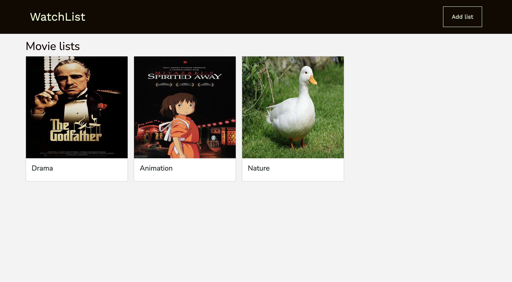

# FreshOut

Web Application to create list of movies, you can categorize them and share with your friends.



## How to run
### Setup

Install gems
```
bundle install
```
Install JS packages
```
yarn install
```

### ENV Variables
Create `.env` file
```
touch .env
```
Inside `.env`, set these variables. For any APIs, see group Slack channel.
```
CLOUDINARY_URL=YOUR_KEY
```

### DB Setup
```
rails db:create
rails db:migrate
rails db:seed
```

### Run a server
```
rails s
```

<br>
